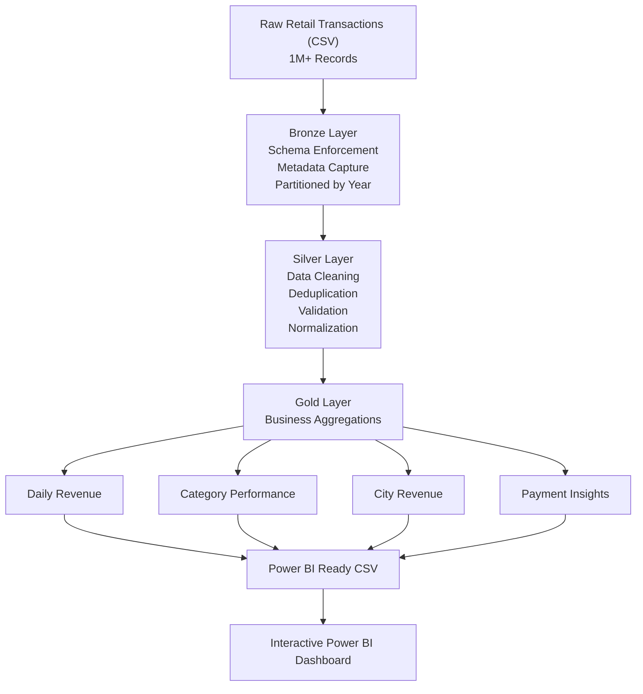
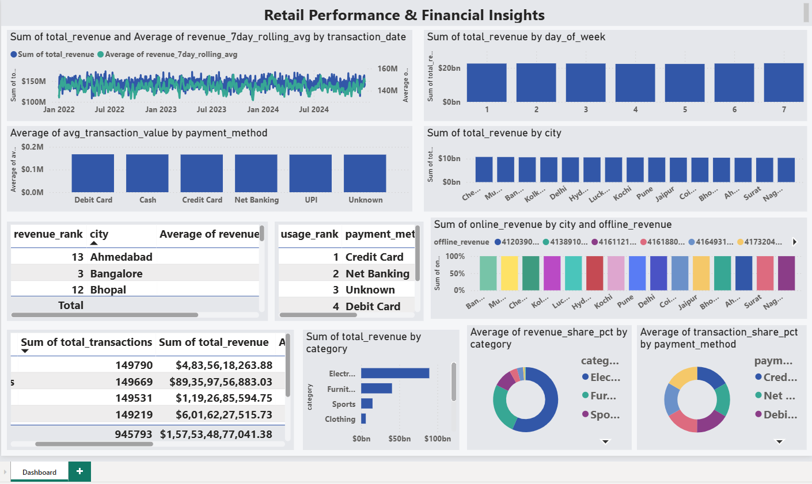

# Retail Analytics Data Engineering Pipeline

A production-style distributed data engineering project that processes over **1 million retail transactions** using **Apache Spark** and **PySpark** on a **Docker-based Spark cluster**. The pipeline follows the **Medallion Architecture (Bronze → Silver → Gold)** to transform raw transactional data into analytics-ready datasets that can be directly consumed by **Power BI** for business reporting.

---

# Business Problem

Retail organizations collect millions of transactions every day from online and offline sales channels. Raw transactional data often contains duplicates, missing values, inconsistent formats, invalid records, and other quality issues that prevent reliable business reporting.

Without a structured data engineering pipeline, analytics teams spend significant time cleaning data instead of generating business insights.

This project demonstrates how a modern data engineering workflow transforms raw operational data into trusted analytical datasets using distributed processing.

---

# Business Value

This pipeline enables organizations to:

* Process large retail datasets using distributed Spark execution.
* Improve data reliability through schema enforcement and data quality validation.
* Standardize inconsistent transactional data for downstream analytics.
* Generate business-ready aggregated datasets following Medallion Architecture.
* Reduce reporting time by exporting Power BI-ready datasets.
* Provide scalable architecture that can be extended to cloud platforms such as Databricks, Azure Synapse, AWS EMR, or Google Dataproc.

---

# Project Overview

The project simulates a production retail analytics platform rather than a notebook-based data analysis exercise.

Key capabilities include:

* Generates **1,000,000+ synthetic retail transactions** with controlled data quality issues.
* Runs a distributed Spark cluster using **Docker Compose** (1 Spark Master + 2 Spark Workers).
* Uses **explicit Spark schemas** throughout the pipeline (no `inferSchema`).
* Implements a complete **Bronze → Silver → Gold** Medallion Architecture.
* Performs validation, cleansing, normalization, deduplication, and business transformations.
* Produces analytical Gold tables optimized for reporting.
* Exports final datasets as CSV files for Power BI.
* Includes Spark UI monitoring for observing distributed execution.

---

# Architecture



---

# Technology Stack

| Technology       | Purpose                          |
| ---------------- | -------------------------------- |
| Apache Spark 3.5 | Distributed data processing      |
| PySpark          | Spark application development    |
| Docker           | Containerized Spark cluster      |
| Docker Compose   | Multi-node cluster orchestration |
| Python 3.9+      | Pipeline development             |
| Pandas           | Synthetic data generation        |
| NumPy            | Randomized data generation       |
| Faker            | Realistic retail data generation |
| PyArrow          | Parquet read/write support       |
| Power BI Desktop | Dashboard visualization          |

---

# Project Structure

```text
retail_analytics/
│
├── docker/
│   └── docker-compose.yml
│
├── data/
│   ├── raw/
│   ├── bronze/
│   ├── silver/
│   ├── gold/
│   ├── powerbi/
│   └── dashboard_screenshots/
│
├── src/
│   ├── generate_data.py
│   ├── bronze_layer.py
│   ├── silver_layer.py
│   ├── gold_layer.py
│   ├── export_for_powerbi.py
│   ├── quality_report.py
│   └── run_pipeline.py
│
├── logs/
├── requirements.txt
├── README.md
└── .gitignore
```

---

# Dataset

The synthetic dataset represents retail transactions collected from multiple stores and online channels.

Each transaction contains information such as:

* Transaction ID
* Customer ID
* Product Name
* Category
* Quantity
* Price
* Discount
* Payment Method
* Store Type
* City
* Transaction Date

More than **1 million records** are generated to demonstrate distributed processing.

---

# Intentional Data Quality Issues

To simulate real-world production data, the generator injects common quality problems.

| Issue                        | Approximate Volume |
| ---------------------------- | -----------------: |
| Duplicate transactions       |             20,000 |
| Null customer IDs            |             30,000 |
| Missing price/quantity       |              5,000 |
| Negative prices              |             10,000 |
| Zero quantity                |             10,000 |
| Invalid discount values      |             15,000 |
| Mixed date formats           |            150,000 |
| Inconsistent category casing |         Throughout |
| Leading/trailing whitespace  |         Throughout |

After Silver layer processing, approximately **92%** of records remain as validated business-ready data.

---

# Medallion Architecture

## Bronze Layer

Purpose: Preserve raw source data while enforcing schema consistency.

Processing includes:

* Explicit `StructType` schema
* PERMISSIVE ingestion mode
* Metadata enrichment
* Raw data preservation
* Partitioning by ingestion year
* Null auditing

Output:

```
data/bronze/
```

---

## Silver Layer

Purpose: Produce clean and standardized transactional data.

Transformations include:

* Remove invalid records
* Deduplicate using window functions
* Standardize date formats
* Normalize text fields
* Normalize store type
* Clamp discount values
* Compute net revenue
* Fill missing payment methods
* Partition by category

Business Metric:

```
net_revenue = price × quantity × (1 − discount)
```

Output:

```
data/silver/
```

---

## Gold Layer

Purpose: Build business-focused analytical datasets.

The Silver dataset is cached before generating multiple aggregations to reduce repeated scans.

Generated tables include:

| Table                | Description                         |
| -------------------- | ----------------------------------- |
| Daily Revenue        | Revenue trends and rolling averages |
| Category Performance | Category KPIs and rankings          |
| City Revenue         | Geographic revenue distribution     |
| Payment Insights     | Payment channel analysis            |

Output:

```
data/gold/
```

---

# Data Quality Pipeline

The Silver layer performs several validation steps before records are promoted to Gold.

* Schema validation
* Null handling
* Duplicate removal
* Invalid price filtering
* Invalid quantity filtering
* Date standardization
* Discount normalization
* Text normalization
* Business metric calculation

A separate quality report summarizes rejected records and overall pipeline quality.

---

# Gold Layer Tables

## Daily Revenue

Business metrics include:

* Daily Revenue
* Transaction Count
* Unique Customers
* 7-Day Rolling Average
* Day-over-Day Growth %

---

## Category Performance

Business metrics include:

* Revenue
* Revenue Share
* Revenue Rank
* Average Basket Size
* Revenue per Unit
* Unique Product Count

---

## City Revenue

Business metrics include:

* Revenue by City
* Online vs Offline Revenue
* Revenue per Customer
* City Ranking

---

## Payment Insights

Business metrics include:

* Payment Method Usage
* Revenue Share
* Transaction Share
* Top Category by Payment Method
* Payment Ranking

---

# Power BI Dashboard

The final datasets are exported to:

```
data/powerbi/
```

These files can be directly imported into Power BI Desktop.

Suggested visualizations include:

* Revenue trend analysis
* Category contribution
* Geographic revenue distribution
* Online vs Offline comparison
* Payment method distribution
* KPI cards
* Interactive slicers

---

# Dashboard Preview

### Retail Performance & Financial Insights



---

# Spark Cluster

The project runs on a distributed Spark cluster using Docker.

Cluster configuration:

* 1 Spark Master
* 2 Spark Workers
* Distributed task execution
* Parallel transformations
* Spark UI monitoring

Spark Master:

```
http://localhost:8080
```

The Spark UI can be used to monitor:

* Active applications
* Executors
* Jobs
* Stages
* Tasks
* Shuffle operations
* Memory utilization

---

# Setup

## Clone Repository

```bash
git clone https://github.com/your-username/retail-analytics-pipeline.git

cd retail-analytics-pipeline
```

## Install Dependencies

```bash
pip install -r requirements.txt
```

## Start Spark Cluster

```bash
cd docker

docker-compose up -d
```

Verify the Spark cluster by opening:

```
http://localhost:8080
```

---

# Running the Pipeline

Run the complete pipeline:

```bash
docker exec -it spark-master python /opt/spark/src/run_pipeline.py
```

Or execute each stage independently.

Generate Data

```bash
docker exec -it spark-master python /opt/spark/src/generate_data.py
```

Bronze Layer

```bash
docker exec -it spark-master spark-submit \
--master spark://spark-master:7077 \
--executor-memory 1g \
--driver-memory 1g \
--num-executors 2 \
/opt/spark/src/bronze_layer.py
```

Silver Layer

```bash
docker exec -it spark-master spark-submit \
--master spark://spark-master:7077 \
--executor-memory 1g \
--driver-memory 1g \
--num-executors 2 \
/opt/spark/src/silver_layer.py
```

Gold Layer

```bash
docker exec -it spark-master spark-submit \
--master spark://spark-master:7077 \
--executor-memory 1g \
--driver-memory 1g \
--num-executors 2 \
/opt/spark/src/gold_layer.py
```

Export Power BI Files

```bash
docker exec -it spark-master spark-submit \
--master spark://spark-master:7077 \
--executor-memory 1g \
--driver-memory 1g \
/opt/spark/src/export_for_powerbi.py
```

Generate Data Quality Report

```bash
docker exec -it spark-master spark-submit \
--master spark://spark-master:7077 \
--executor-memory 1g \
--driver-memory 1g \
/opt/spark/src/quality_report.py
```

Stop the cluster:

```bash
cd docker

docker-compose down
```

---

# Key Engineering Concepts Demonstrated

* Distributed Spark execution
* Docker-based Spark cluster
* Explicit schema enforcement
* Medallion Architecture
* Window functions
* Partition pruning
* Data validation
* Data quality auditing
* Business aggregation modeling
* Parquet optimization
* Power BI integration
* Production-oriented project organization


